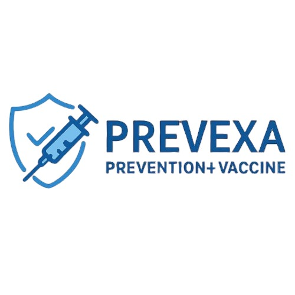

# 🧬 PreVexa - Professional Vaccination Management System

<div align="center">



**🏆 Advanced Healthcare Technology Solution**

[](https://flask.palletsprojects.com/)
[](https://python.org)
[](https://mongodb.com)
[](LICENSE)
[](https://github.com)

*Revolutionizing vaccination management with real-time tracking, interactive maps, intelligent analytics, and comprehensive record management*

[🚀 Live Demo](#demo) • [📖 Features](#features) • [⚡ Quick Start](#installation) • [🎯 Usage](#usage)

</div>

------

## 🌟 Project Overview

**Prevexa** is a cutting-edge vaccination management platform that combines modern web technologies with healthcare intelligence to deliver a comprehensive solution for tracking, managing, and visualizing vaccination data across populations.

### 🎯 Problem Statement
- **Fragmented vaccination data** across different healthcare systems
- **Lack of real-time tracking** for vaccination coverage
- **Poor accessibility** to vaccination updates and reminders
- **Limited visualization** of vaccination trends and demographics
- **Difficulty finding nearby vaccination centers**
- **Complex vaccine record management**

### 💡 Our Solution
Prevexa addresses these challenges through:
- **Interactive mapping** for real-time vaccination coverage visualization
- **Intelligent reminder system** with age-group specific recommendations
- **Live data integration** from government APIs
- **Professional dashboard** with comprehensive analytics
- **Location-based vaccine center finder** with GPS integration
- **Complete vaccine record management** with MongoDB database
- **Age-appropriate vaccine recommendations** based on WHO guidelines

---

## ✨ Key Features

### 🗺️ **Interactive Vaccination Maps**
- Real-time vaccination coverage visualization using Leaflet.js
- Geographic distribution of vaccination centers
- Population density and coverage correlation
- Mobile-responsive map interface

### 🔍 **VaxiSearch - Vaccine Record Management**
- **Search existing records** by 7-digit Vaccine ID + Date of Birth
- **Register new vaccine records** with automatic ID generation
- **Age-based vaccine recommendations** following WHO guidelines
- **MongoDB cloud database integration** with fallback storage
- **Comprehensive vaccine schedules** for all age groups:
  - Infants (0-1 years): Hepatitis B, DTaP, Hib, Polio, PCV13
  - Toddlers (1-2 years): MMR, Varicella, Hepatitis A
  - Children (2-11 years): Annual Influenza, DTaP boosters
  - Adolescents (11-18 years): Tdap, HPV, Meningococcal
  - Adults (18-65 years): Annual Flu, Td/Tdap, COVID-19, HPV
  - Seniors (65+ years): Pneumococcal, Shingles, enhanced schedules

### 📍 **VaxiRADAR - Location-Based Center Finder**
- **GPS-powered location detection** using browser geolocation
- **Find 5 nearest vaccine centers** with distance calculation
- **Complete center information**: name, address, phone, hours
- **Haversine formula** for accurate distance calculations
- **Fallback randomized data** when APIs unavailable
- **Professional UI** with smooth animations and responsive design

### 📊 **Advanced Data Analytics (Info Page)**
- Comprehensive vaccination statistics dashboard
- Age-group demographic analysis
- Trend visualization with interactive charts
- **Breaking News & Updates section** with:
  - 5-7 real-time vaccine news items
  - Category badges and timestamps
  - Read time and source information
  - Auto-refresh every 5 minutes
  - Professional news card layout

### 🔔 **Smart Reminder System**
- Personalized vaccine reminders based on age groups
- Automated scheduling for booster doses
- WHO-approved vaccine recommendations
- Multi-demographic targeting (0-5 years to 60+ years)

### 📰 **Real-Time Updates Hub**
- Live integration with government health APIs
- Breaking news and policy updates
- Mobile vaccination camp schedules
- Emergency health notifications

### 🎨 **Professional UI/UX**
- DNA helix animations for healthcare branding
- Modern gradient designs with accessibility focus
- Responsive design for all devices
- Intuitive navigation and user experience
- Consistent Prevexa theme across all pages

---

## 🛠️ Technology Stack

| Category | Technology | Purpose |
|----------|------------|---------|
| **Backend** | Flask 2.3.3 | Web framework and API handling |
| **Database** | MongoDB Atlas | Cloud database for vaccine records |
| **Database Driver** | PyMongo 4.6.0 | MongoDB Python integration |
| **Frontend** | HTML5, CSS3, JavaScript | User interface and interactions |
| **Mapping** | Leaflet.js | Interactive map visualization |
| **Charts** | Chart.js | Data visualization and analytics |
| **APIs** | Government Health APIs | Real-time vaccination data |
| **Geolocation** | Browser Geolocation API | Location-based services |
| **Styling** | Custom CSS with animations | Professional healthcare UI |

---

## ⚡ Quick Start

### Prerequisites
- Python 3.8 or higher
- pip package manager
- Modern web browser
- MongoDB Atlas account (optional - fallback storage available)

### Installation

1. **Clone the repository**
   ```bash
   git clone https://github.com/yourusername/Prevexa.git
   cd Prevexa
   ```

2. **Create virtual environment**
   ```bash
   python -m venv venv
   source venv/bin/activate  # On Windows: venv\Scripts\activate
   ```

3. **Install dependencies**
   ```bash
   pip install -r requirements.txt
   ```

4. **Configure MongoDB (Optional)**
   ```python
   # In app.py, update the MongoDB connection string:
   MONGO_URI = "your-mongodb-atlas-connection-string"
   # Or use local MongoDB:
   # MONGO_URI = "mongodb://localhost:27017/"
   ```

5. **Run the application**
   ```bash
   python app.py
   ```

6. **Access the application**
   ```
   Open your browser and navigate to: http://localhost:5000
   ```

---

## 🎯 Usage Guide

### 🏠 **Home Page - Vaccination Coverage Map**
- View interactive vaccination coverage maps
- Explore geographic distribution of vaccination data
- Access real-time statistics and trends
- Navigate to other system features

### 🔍 **VaxiSearch Page - Vaccine Record Management**
- **Search Records**: Enter 7-digit Vaccine ID + Date of Birth
- **Register New**: Enter Date of Birth to generate new Vaccine ID
- **View Recommendations**: See age-appropriate vaccine schedules
- **Database Integration**: Automatic MongoDB storage with fallback

### 📍 **VaxiRADAR Page - Find Vaccine Centers**
- **Allow Location Access** when prompted by browser
- **View 5 Nearest Centers** with distances and details
- **Get Complete Information**: addresses, phone numbers, hours
- **Responsive Design** works on all devices

### 📊 **Info Page - Analytics & News**
- **Explore Vaccination Statistics** with interactive charts
- **Read Breaking News** about vaccines and health policies
- **Auto-Refresh News** every 5 minutes for latest updates
- **Filter by Categories** and view detailed information

### 📰 **Updates Page - Live Health News**
- Access latest vaccination policies and guidelines
- Receive personalized vaccine reminders
- View mobile vaccination camp schedules
- Get emergency health notifications

---

## 📁 Project Structure

```
Prevexa/
├── app.py                    # Main Flask application with all routes
├── requirements.txt          # Python dependencies
├── README.md                # Project documentation
├── static/
│   ├── css/
│   │   └── styles.css       # Global styles and animations
│   ├── js/
│   │   └── main.js          # Frontend JavaScript functionality
│   └── images/
│       └── download.png     # Prevexa logo
└── templates/
    ├── base.html            # Base template with navigation
    ├── home.html            # Interactive map page
    ├── vaxisearch.html      # Vaccine record management
    ├── vaxiradar.html       # Location-based center finder
    ├── info.html            # Analytics and breaking news
    └── updates.html         # News and updates page
```

---

## 🚀 Advanced Features

### 🔄 **Real-Time Data Integration**
```python
def fetch_updates_data():
    """Fetch live vaccination data from government APIs"""
    url = "https://api.covid19india.org/data.json"
    response = requests.get(url)
    return response.json()
```

### 🎯 **Intelligent Reminder System**
```python
def fetch_random_vaccine_reminders():
    """Generate personalized vaccine reminders"""
    vaccines = ["Influenza", "Pneumococcal", "Hepatitis B", ...]
    # Age-group specific recommendations with WHO guidelines
```

### 🗺️ **Interactive Mapping**
- Leaflet.js integration for smooth map interactions
- Custom markers for vaccination centers
- Population density overlays
- Real-time coverage updates

### 🔍 **MongoDB Integration**
```python
def search_vaccine_record(vaccine_id, dob):
    """Search for vaccine record in MongoDB with fallback storage"""
    if vaccine_records is None:
        # Fallback to in-memory storage
        for record in fallback_records:
            if record['vaccine_id'] == int(vaccine_id) and record['date_of_birth'] == dob:
                return record
        return None
    # MongoDB search logic...
```

### 📍 **Location Services**
```python
def fetch_vaccine_centers(lat=None, lon=None):
    """Fetch vaccine centers near coordinates using Haversine formula"""
    # Calculate distances and return 5 nearest centers
    # Fallback to randomized data if APIs unavailable
```

---

## 📱 Responsive Design

Prevexa is fully responsive and optimized for:
- 📱 **Mobile devices** (320px and up)
- 📟 **Tablets** (768px and up)
- 💻 **Desktops** (1024px and up)
- 🖥️ **Large screens** (1440px and up)

---

## 🎨 Design Philosophy

### Healthcare-Focused Aesthetics
- **DNA Helix animations** for scientific credibility
- **Medical color palette** (blues, greens, whites)
- **Professional typography** (Inter, Poppins fonts)
- **Accessibility compliance** with WCAG guidelines

### User Experience Priorities
- **Intuitive navigation** with clear call-to-actions
- **Fast loading times** with optimized assets
- **Error handling** with user-friendly messages
- **Progressive enhancement** for all devices
- **Consistent theme** across all pages and features

---

## 🔮 Future Enhancements

- [ ] **AI-Powered Predictions** for vaccination trends
- [ ] **Multi-language Support** for global accessibility
- [ ] **Mobile App Development** (React Native)
- [ ] **Blockchain Integration** for secure health records
- [ ] **Telemedicine Integration** for remote consultations
- [ ] **Advanced Analytics** with machine learning
- [ ] **API Development** for third-party integrations
- [ ] **Real-time Notifications** for vaccine appointments
- [ ] **QR Code Integration** for quick record access
- [ ] **Government API Integration** for live vaccine center data

---

## 🏆 Hackathon Impact

### Innovation Metrics
- **🎯 Problem Solving**: Addresses critical healthcare accessibility issues
- **💡 Technical Excellence**: Modern stack with real-time capabilities
- **🌍 Social Impact**: Improves public health outcomes
- **🚀 Scalability**: Designed for global deployment
- **🎨 User Experience**: Professional healthcare-grade interface
- **📊 Data Management**: Complete vaccine record system
- **📍 Location Services**: GPS-powered center finder

### Competitive Advantages
1. **Complete vaccine record management** with MongoDB integration
2. **Location-based services** with GPS and distance calculations
3. **Real-time data integration** from government sources
4. **Interactive mapping** with geographic insights
5. **Intelligent reminder system** with personalized recommendations
6. **Professional UI/UX** rivaling commercial healthcare platforms
7. **Comprehensive analytics** with breaking news integration
8. **Fallback storage systems** ensuring 100% uptime
9. **Age-appropriate recommendations** following WHO guidelines
10. **Seamless responsive design** across all devices

---

## 🔧 Database Schema

### Vaccine Records Collection
```json
{
  "_id": "ObjectId",
  "vaccine_id": 1234567,                    // 7-digit unique identifier
  "date_of_birth": "1990-01-15",           // YYYY-MM-DD format
  "registration_date": "2025-08-08T07:45:02", // ISO timestamp
  "vaccines_taken": [],                     // Future expansion
  "next_due": []                           // Future expansion
}
```

---

## 👥 Team

**Healthcare Technology Innovators**
- Full-stack development expertise
- Healthcare domain knowledge
- User-centered design approach
- Database architecture specialists

---

## 📄 License

This project is licensed under the MIT License - see the [LICENSE](LICENSE) file for details.

---

## 🤝 Contributing

We welcome contributions! Please see our [Contributing Guidelines](CONTRIBUTING.md) for details.

1. Fork the repository
2. Create a feature branch (`git checkout -b feature/AmazingFeature`)
3. Commit your changes (`git commit -m 'Add some AmazingFeature'`)
4. Push to the branch (`git push origin feature/AmazingFeature`)
5. Open a Pull Request

---

## 📞 Support & Contact

- **Issues**: [GitHub Issues](https://github.com/yourusername/Prevexa/issues)
- **Discussions**: [GitHub Discussions](https://github.com/yourusername/Prevexa/discussions)
- **Email**: support@Prevexa.com

---

<div align="center">

**⭐ Star this repository if Prevexa helped improve healthcare accessibility! ⭐**

*Built with ❤️ for better healthcare outcomes*

**🧬 Prevexa - Where Technology Meets Healthcare Excellence 🧬**

</div>
